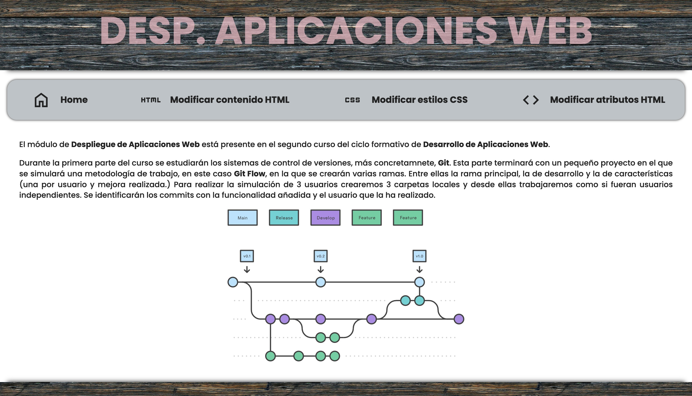
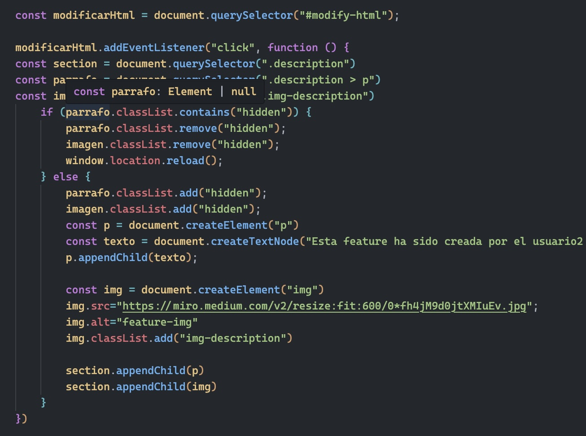
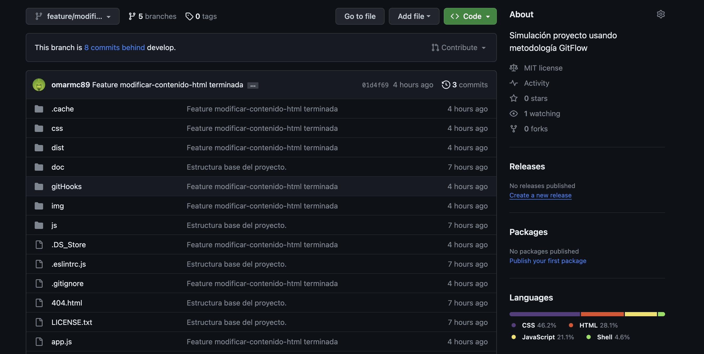
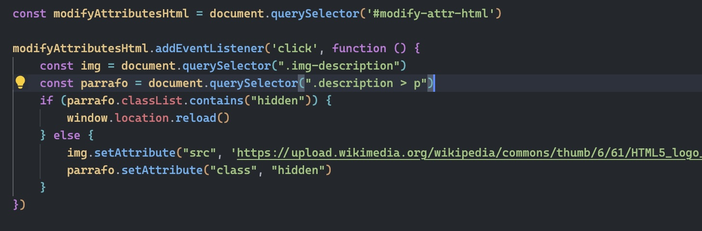
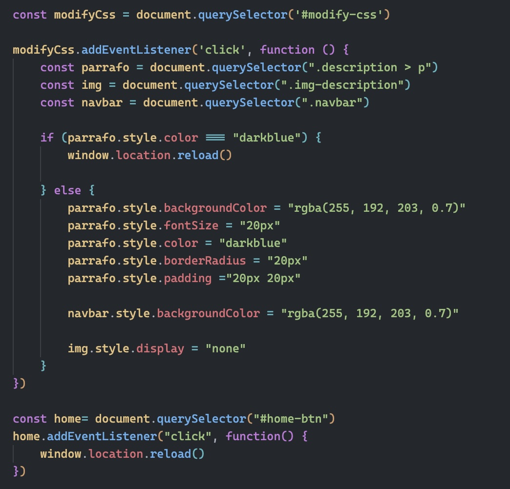
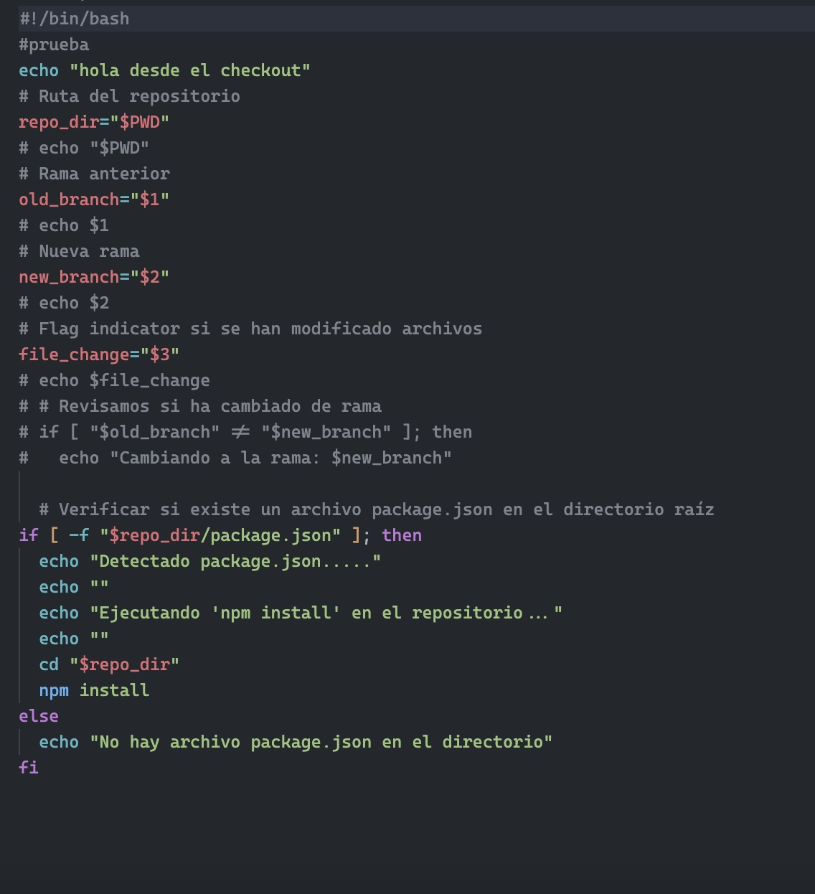
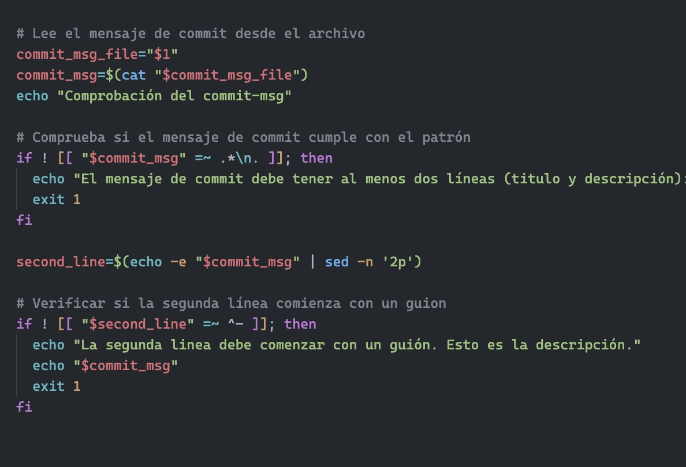
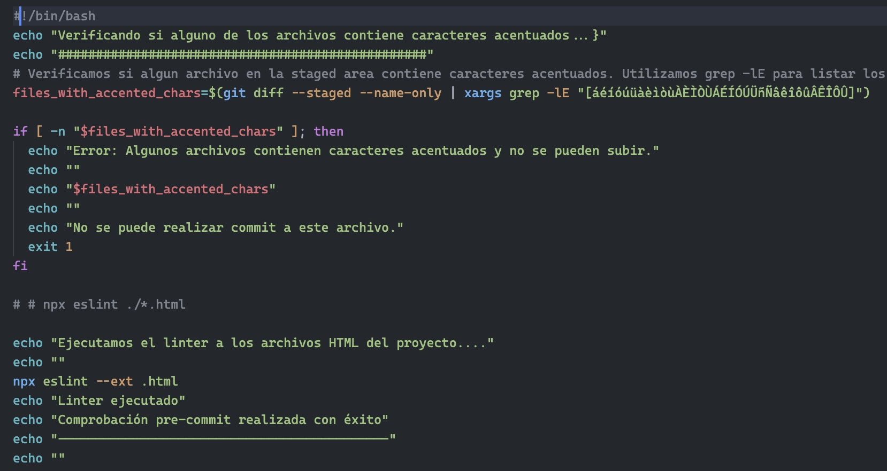

# 💻 Simulación de un proyecto con GitFlow 💻
***

#### Tecnologías utilizadas

***

- [💻 Simulación de un proyecto con GitFlow 💻](#-simulación-de-un-proyecto-con-gitflow-)
      - [Tecnologías utilizadas](#tecnologías-utilizadas)
      - [Descripción](#descripción)
      - [Introducción](#introducción)
      - [GitFlow](#gitflow)
      - [GitHub](#github)
      - [Proyecto](#proyecto)
      - [Proceso](#proceso)
      - [Git Hooks](#git-hooks)

#### Descripción
En este repositorio se simula el flujo de trabajo de un proyecto utilizando la metodología **GitFlow**.

#### Introducción

Git se trata de un sistema de control de versiones distribuido muy utilizado en el desarrollo de software. Su función principal es rastrear los cambios en el código fuente a lo largo del tiempo y facilitar la colaboración entre equipos de desarrollo.

Entre sus muchas funciones, destacan:

- La creación de **ramas** independientes para facilitar el desarrollo paralelo de características nuevas sin afectar el código existente
- Git es un sistema de control de versiones **distribuido**, lo que significa que cada desarrollador tiene una copia completa del historial del repositorio. Esto permite a los desarrolladores trabajar de forma independiente y sin conexión a Internet.
  
#### GitFlow
Gitflow es un modelo de flujo de trabajo para Git que establece un conjunto de reglas para estructurar ramas y organizar el desarrollo del software.

Este modelo define dos ramas principales: **main** y **develop**. La rama main representa la última versión estable del software, mientras que la rama develop es donde se integran y prueban nuevas características antes de lanzarlas.
Además de estas ramas, para añadir las diferentes características añadidas al proyecto se utilizan las ramas **feature** (una por característica), para reparar posibles fallos **hotfix** y para el lanzamiento de versiones **release**. Estas útlimas son el útlimo paso antes de incorporar la vesión definitiva a la rama **main**.
Uno de sus puntos negativos es que es un proceso lento y puede resultar tedioso, sobretodo para proyectos pequeños pero compensa con su nivel de seguridad y estructuración. Eso permite que pueda haber pocos conflictos y la organización del equipo de desarrollo queda muy marcada.

#### GitHub
GitHub es una plataforma de alojamiento de repositorios de control de versiones Git que facilita la colaboración y el seguimiento de cambios en proyectos de software.

Permite a los desarrolladores almacenar, compartir y gestionar el código fuente, además de ofrecer herramientas como problemas, solicitudes de extracción y seguimiento de proyectos.

#### Proyecto
Se simula un pequeño proyecto que consta de una página web con varios botones los cuáles modifican estilos y el HTML. Cada característica añadida estará realizada por un usuario diferente.

En este caso para simular los diferentes miembros del equipo trabajaremos en carpetas diferentes, realizando los distintos comandos de git en cada una de ellas.

***

<h5 style="text-align: center;">Resultado final</h5>

***

#### Proceso

Documentación de los pasos realizados:

En primer lugar creamos el repositorio en github.

El usuario 1 debe crear la base del proyecto sobre el que trabajará el resto del equipo. Por tanto debemos vincular el reposiorio local con el remoto de github. Para ello en la carpeta del usuario 1 iniciamos git con el comando *git init*. Seguidamente vinculamos el repositorio local con el remoto de github con el comando *git remote*. 
Una vez hecho esto nos queda añadir los archivos a la *stage area* utilizando *git add .* y después realizar el primer commit con *git commit*.

En la rama **main** solo deben quedar reflejadas las versiones del proyecto por lo que creamos un *tag* y subimos todos los archivos al repositorio remoto con *git push*

Para asegurarnos que en la rama main no se implemente nada por error en las opciones del repositorio ponemos la rama **develop** por defecto.

En este punto el Usuario 1 ya ha establecido el esquema general del proyecto por lo que el resto de usuario ya pueden empezar a realizar los trabajos correspondientes.
Empezando por el usuario 2, en primer lugar se debe descargar el repositorio en su carpeta personal utilizando el comando *git clone*.

Como primera feature a implantar, debe desarrollar el código para modificar el contenido HTML de la página.
Como ejemplo se ha modificado la imagen principal y el contenido del párrafo de la descripción.

Como dicta la metodología **GitFlow** que estamos siguiendo, debemos crear una rama específica para esta rama. En este caso *feature/modificar-contenido-html*. Con el comando *git branch* y *git switch* creamos y nos transladamos a la rama idicada.

Como se detallará más adelante, en esta captura se puede apreciar uno de los *git hooks* generados para que cuando cambiemos de rama o clonemos el repositorio se instalen los paquetes necesarios para el funcionamiento del proyecto.
Como se repetirá a lo largo del proyecto, una vez terminada la *feature* debemos añadir los archivos a la *stage area* y subirlos al repositorio remoto en la rama indicada. Para ello realizamos *git commit* y *git push* (se debe indicar la rama que se sube al repositorio).

En la captura se puede ver que se ha añadido la flag *--amend* para modificar el texto del commit realizado ya que se estaban realizando pruebas de los hooks.

Llegados a este punto, subimos al repositorio remoto la rama *feature/modificar-contenido-html* con *git push origin feature/modificar-contenido-html* y ya estaría guardado en GitHub.

Como paso final se debe cerrar la rama de la feature creada con el comando *git merge feature/modificacar-contenido-html* desde la rama **develop**.

Como segunda tarea del usuario 2 se debe implementar la modificación de algunos atributos HTML y de nuevo, como se hizo con la anterior feature, creamos la rama *feature/modificar-atributos-html*. Cuando se termina el desarrollo de la característica, se añaden los archivos al *área de intercambio*, se realiza el *commit* y se sube la rama al repositorio con el *git push*.

La feature 2 modifica el atributo *src* de la imagen por otro y añade la clase *hidden* al texto.

Otra vez, como paso final en la rama de la segunda feature, debemos hacer el *merge* a la rama develop con el comando *git merge*. En esta captura, creamos una *alias* para dibujar las ramas desde la terminal. Como se puede observer el último *merge* es el de la feature 2.

Pasamos al usuario 3 y de igual forma que el usuario 2, el primer paso es descargar en la carpeta local el repositorio en el estado de las dos features anteriores terminadas. No pasaría nada si no se hubiera terminado el desarrollo de alguna de las dos características a implementar. Una de las ventajas de seguir GitFlow es que se desarrollan los nuevas funcionalidaes en ramas independientes, con lo que cuando una esta lista se hace *merge* a la rama develop. Como paso intermedio antes de realizar un *merge* se utiliza el comando *git pull* para descargar los archivos de la rama develop en tiempo real.

La funcionalidad del usuario 3 consiste en modificar los estilos CSS por lo que modificamos algunos fondos, tamaño de la fuente, color y el padding.

En este punto ya se han implementado todas las características objetivo por lo que el Usuario 1 debe fusionar todo los cambios en la rama principal del proyecto. Para ello en la carpeta de dicho usuario realizamos un *git pull* de la rama **develop** y descargar todo el proyecto actualizado.

Siguiendo el flujo de trabajo de *GitFlow* el usuario 1 crea la rama *release/v_1.0* para lanzar la versión definitiva. En este punto se confirma que la versión es correcta y esta rama se fusiona con la rama **main**. 

Ahora es definitiva la versión 1.0 del proyecto por lo que realizamos un tag y que quede definido correctamente en la rama principal.

Como paso opcional, se crea la rama *test* y se sube al repositorio para que los testers realicen en ella las pruebas correspondientes.

En la metodología de GitFlow se indica que una vez se fusionan las ramas *feature* se deben elminar ya que quedan implementadas en la rama **develop** funcionando de manera correcta y definitiva. Cada usuario eliminó su rama *feature* en el momento que realizó el *merge* a la rama **develop**

#### Git Hooks

Como requisito se debía realizar tres hooks:

* Automatización del comando *npm install* con el clone/checkout.

Test:

* Comprobación del mensaje en el commit. Debe tener titulo y descripción:

  

* Ejecución del linter para comprobar los archivos HTML.
  

